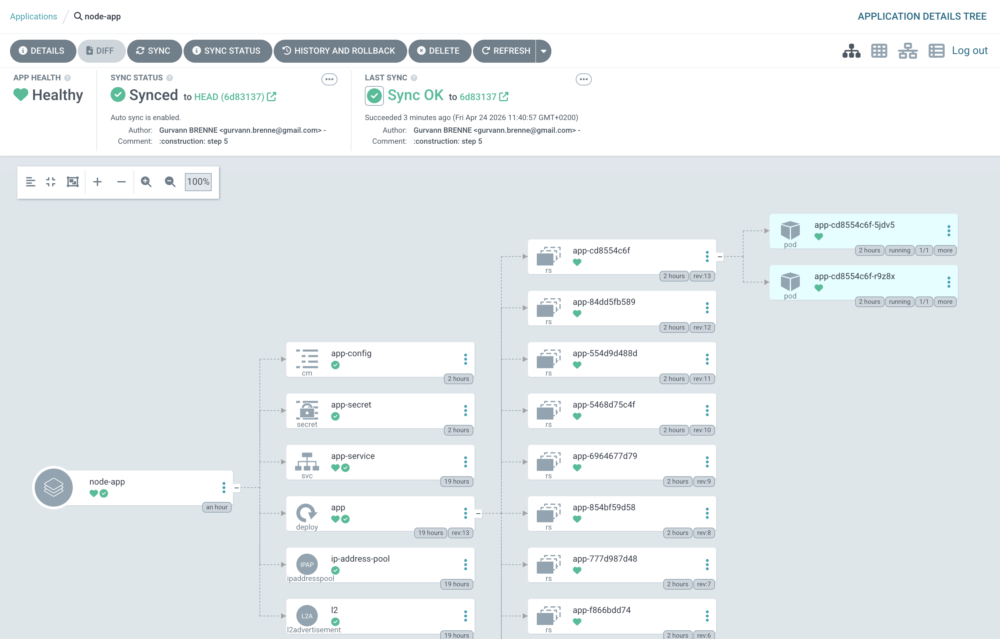

# Étapes

## Étape 1

Écriture du code dans le fichier `app.js` :

```javascript
const fs = require('fs');
const express = require('express');
const app = express();
// Lecture fichier de configuration
let config = {};
try {
    const rawConfig = fs.readFileSync('/app/config/config.json');
    config = JSON.parse(rawConfig);
} catch (err) {
    console.log("No config file found, using defaults");
}
// Variables d'environnement (secrets)
const dbUser = process.env.DB_USER || "default_user";
const dbPassword = process.env.DB_PASSWORD || "default_password";
app.get('/', (req, res) => {
    res.json({
        message: config.message || "Hello World",
        database: {
            user: dbUser,
            password: dbPassword ? "******" : "not set"
        }
    });
});
app.listen(3000, () => {
    console.log("Server started on port 3000");
});
```

Initialisation d'un projet Node.js et installation d'Express :

```bash
npm init -y
npm install express
```

Rédaction du Dockerfile (Fichier Dockerfile)

Build de l'image Docker :

```bash
docker build -t gurvannbrenne/app:1.0.0 .
```

Test local du conteneur :

```bash
docker run --rm --name=node-app-test-container -p 3000:3000 -e DB_USER=test_user -e DB_PASSWORD=test_password gurvannbrenne/app:1.0.0
curl http://localhost:3000
``` 

On attend le résultat suivant :

```json
{"message":"Hello World"}
```

On peut arrêter le container :

```bash
docker stop node-app-test-container
```

## Étape 2

Création du manifest Kubernetes (Fichier: deployment.yaml)

Déploiement dans Kubernetes :

Pour que kubernetes puisse trouver l’image, il faut d’abord la pousser sur un registry accessible

```bash
docker login # Se connecter à Docker Hub ou un autre registry
docker push gurvannbrenne/app:1.0.0 # Push l'image sur le registry
kubectl apply -f deployment.yaml # Appliquer le manifest Kubernetes (donc créer le Deployment)
kubectl get deployments # Vérifie que le Deployment a été créé
kubectl get pods # Vérifie qu'il y a bien 2 pods en état Running
```

On expose ensuite l'application avec un Service Kubernetes (Fichier: service.yaml)

```bash
kubectl apply -f service.yaml # Appliquer le manifest du Service
kubectl get services # Vérifie que le Service a été créé
```

On vérifie ensuite la connexion à l’application depuis un autre pod :

```bash
kubectl run app-test-service --image=nicolaka/netshoot -it --rm -- /bin/bash
curl http://app-service
```

On doit de nouveau retrouver le JSON de tout à l'heure

Accéder à l'app depuis l'extérieur du cluster :

Pour cela, on met en place MetalLB

On change le deployment en LoadBalancer en ajoutant "type: LoadBalancer" dans le manifest du service

```bash
kubectl apply -f service.yaml # Appliquer le manifest du Service modifié
kubectl get services # Vérifie que le Service a été mis à jour et n'a pas encore d'IP externe (<pending>)
```

On applique les fichiers de configuration de MetalLB (Fichier: ip-address-pool.yaml & l2advertissement.yaml)

La plage d'adresses IP doit être adaptée à l'environnement. Ici elle est de 192.168.64.100-192.168.64.150 car mon k3s est sur 192.168.3/24

```bash
kubectl apply -f ip-address-pool.yaml
kubectl apply -f l2advertissement.yaml
kubectl get ipaddresspools.metallb.io -n metallb-system # Vérifie que le pool d'adresses IP a été créé
kubectl get l2advertisements.metallb.io -n metallb-system # Vérifie que la configuration d'annonce a été créée
kubectl get services # Vérifie que le Service a maintenant une IP externe
```

Puis on accède à l'application avec le lien http://<IP_EXTERNE> (dans mon cas: http://192.168.64.100)

## Étape 3

Tout d'abord on crée un fichier de configuration dans un ConfigMap Kubernetes (Fichier: configmap.yaml)

```bash
kubectl apply -f configmap.yaml # Appliquer le manifest du ConfigMap
kubectl get configmaps # Vérifie que le ConfigMap a été créé
```

Ensuite on modifie le Deployment pour ajouter le volume et le monter, puis on applique le manifest modifié

```bash
kubectl apply -f deployment.yaml # Appliquer le manifest du Deployment modifié
kubectl get pods # Vérifie que les pods ont été redémarrés pour prendre en compte la nouvelle configuration
```

On peut voir si le fichier a bien été monté dans le conteneur avec :

```bash
kubectl exec -it <POD_NAME> -- cat /app/config/config.json # Mon POD_NAME est app-5c87b96fd8-42hxf
```

Et on retrouve bien nos valeurs :
```json
{
  "message": "Hello from our super kubernetes configmap !"
}
```

On vérifie ensuite que l'application utilise bien les valeurs de la configmap:
On modifie le fichier de configuration pour y mettre des valeurs différentes

```bash
kubectl apply -f configmap.yaml
kubectl rollout restart deployment app # Redémarre le déploiement pour prendre en compte les changements de la configmap
kubectl get pods # Vérifie que les pods ont été redémarrés
kubectl exec -it <POD_NAME> -- cat /app/config/config.json # Vérifie que le fichier de configuration a été mis à jour dans le conteneur
```

## Étape 4

On crée tout d'abord un secret Kubernetes pour stocker les variables d'environnement (Fichier: secret.yaml)

```bash
kubectl apply -f secret.yaml # Appliquer le manifest du Secret
kubectl get secrets # Vérifie que le Secret a été créé
```

```Error from server (BadRequest): error when creating "secret.yaml": Secret in version "v1" cannot be handled as a Secret: illegal base64 data at input byte 8```

Les données doivent être encodées en base64, on effectue donc la modification puis on réapplique

```bash
kubectl apply -f secret.yaml # Appliquer le manifest du Secret
kubectl get secrets # Vérifie que le Secret a été créé
```

Ensuite on modifie le Deployment pour injecter les variables d'environnement à partir du Secret, puis on applique le manifest modifié

```bash
kubectl apply -f deployment.yaml # Appliquer le manifest du Deployment modifié
kubectl get pods # Vérifie que les pods ont été redémarrés pour prendre en compte les nouvelles variables d'environnement
```

En allant sur notre navigateur à l'adresse http://<IP_EXTERNE> utilisée plus tôt, on voit que le nom d'utilisateur a bien été modifié

Si on a besoin de le modifier, il suffit de changer les valeurs dans secret.yaml, dde le réappliquer et de restart le deployment

## Étape 5

Tout d'abord, on crée un namespace dédié à argocd : 

```bash
kubectl create namespace argocd
```

Ensuite, on installe ArgoCD dans ce namespace :

```bash
kubectl apply -n argocd -f https://raw.githubusercontent.com/argoproj/argo-cd/stable/manifests/install.yaml
```

Après l'installation, on vérifie que les pods d'ArgoCD sont en état Running :

```bash
kubectl get pods -n argocd
```
On récupère le mot de passe du panneau de configuration d'argocd (le mot de passe est stocké dans un secret Kubernetes) :

```bash
kubectl get secret argocd-initial-admin-secret -n argocd -o jsonpath="{.data.password}" | base64 -d
```

On peut se connecter au dashboard argocd avec le port forwarding (on se permet de faire du port forwarding car on n'a pas besoin d'exposer argocd à l'extérieur du cluster de façon permanente) :

```bash
kubectl port-forward svc/argocd-server -n argocd 8080:80
```

Et on accède à l'interface web d'ArgoCD à l'adresse http://localhost:8080

Username: admin
Password: (le mot de passe récupéré précédemment)

On crée l'application argocd via le dashboard argocd en pointant vers notre dépôt Git contenant les manifests Kubernetes

Pour simplifier l'accès aux fichiers de k8s, on peut créer un dossier "k8s" à la racine du projet et y mettre tous les manifests Kubernetes (deployment.yaml, service.yaml, configmap.yaml, secret.yaml)

En créant l'application dans argocd, on indique le chemin vers ce dossier "k8s" dans le dépôt Git

On valide et on voit que l'application est créée, tourne et est en bonne santé :



On peut vérifier que l'application se mette bien à jour en changeant le code et en poussant sur git

## Vérifications

On peut dès à présent faire des modifications dans le code, build la nouvelle image Docker, la pousser sur le registry et voir que l'application se met à jour automatiquement grâce à ArgoCD
Si on ne modifie pas le script deployment.yaml pour y mettre la nouvelle image, les pods ne seront pas mis à jour, ils garderont l'anienne version.


